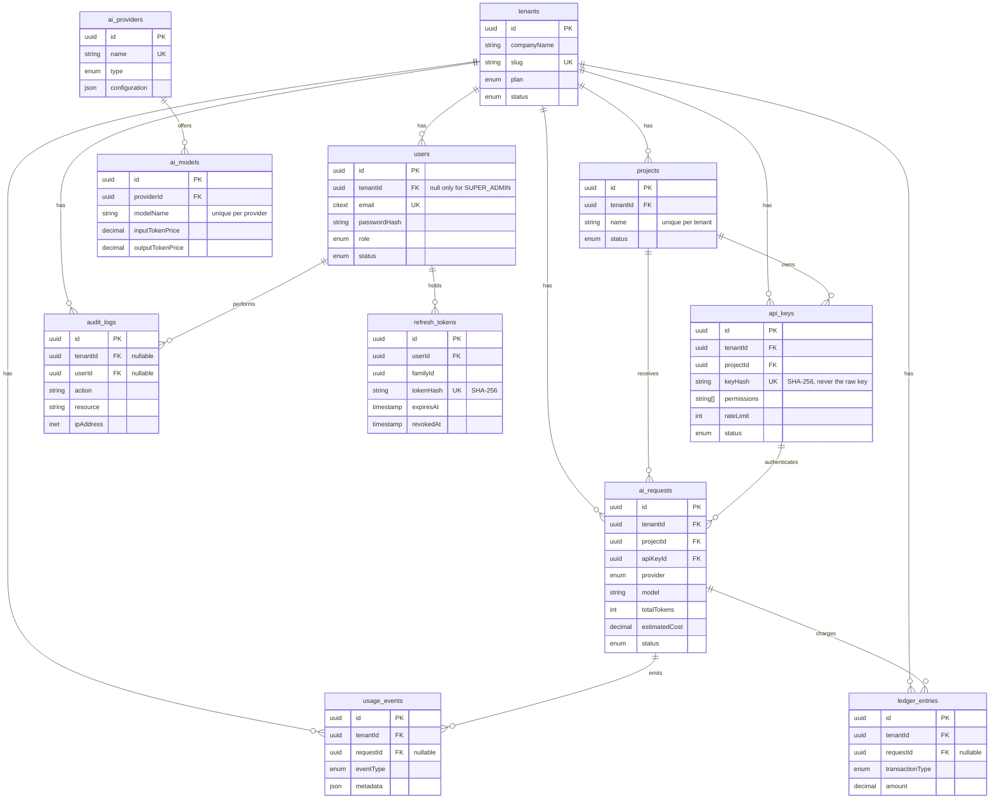

# Database Design

PostgreSQL 16+ (development runs `pgvector/pgvector:pg17`), accessed through Prisma 6.
Schema: [`prisma/schema.prisma`](../../prisma/schema.prisma). Migrations: `prisma/migrations/`.

## 1. Entity overview

| Group             | Tables                                          | Nature                                       |
| ----------------- | ----------------------------------------------- | -------------------------------------------- |
| Tenancy/identity  | `tenants`, `users`                              | Mutable configuration                        |
| Workloads         | `projects`, `api_keys`                          | Mutable configuration                        |
| Catalogue         | `ai_providers`, `ai_models`                     | Platform-wide, not tenant-owned              |
| Traffic and money | `ai_requests`, `usage_events`, `ledger_entries` | Append-only, high volume                     |
| Security          | `audit_logs`, `refresh_tokens`                  | Audit is append-only; tokens are short-lived |

Eleven tables: one per entity in the brief, plus `refresh_tokens`, added in Phase 2 (migration
`002_auth_refresh_tokens`). No join or helper tables.

## 2. ER diagram

## 3. Table descriptions

- **tenants**: a company using the platform. `slug` is unique and constrained to DNS-label format.
  Tenants are retired with `status = DELETED`, not removed.
- **users**: belongs to one tenant. `email` is globally unique and `citext`, so sign-in by email
  needs no tenant picker and `Ada@x.com` equals `ada@x.com`. `role` is an enum today; a future RBAC
  phase can add permission tables without changing this column. A CHECK constraint requires
  `tenantId` for every role except `SUPER_ADMIN` (platform staff), which must have none.
- **projects**: an application that uses AI. Name is unique within a tenant.
- **api_keys**: only `keyHash` (SHA-256 hex) is stored. API keys are high-entropy random strings, so a
  fast hash is correct and allows an indexed lookup by hash; slow password hashes would add latency
  to every gateway call. `keyPrefix` holds the first characters for display. `permissions` is a
  text array of scopes. `rateLimit` is requests per minute, null meaning the plan default.
- **ai_requests**: one row per gateway call. `provider` and `model` are deliberate **snapshots**
  rather than foreign keys, so history is unaffected when catalogue rows change. `estimatedCost` is
  USD, computed at request time. CHECK constraints keep token counts non-negative and
  `totalTokens = requestTokens + responseTokens`.
- **usage_events**: events derived from requests (and alerts such as budget thresholds, where
  `requestId` is null). Shaped as Kafka message payloads for Phase 5: `metadata` is free-form JSON.
- **ledger_entries**: financial record. Append-only: corrections are new `REFUND` or `ADJUSTMENT`
  rows. **Sign convention**: negative = charge to the tenant (`AI_USAGE`), positive = funds added
  (`CREDIT`, `REFUND`). The database enforces the sign for those three types. `amount` is
  `Decimal(18,8)`, never floating point.
- **refresh_tokens**: opaque refresh tokens stored only as SHA-256 hashes, grouped in a `familyId` per
  login. Rotation revokes the old token and adds a new one to the family; reusing a revoked token
  revokes the whole family. Deleted with the user (cascade). Indexed on `tokenHash` (unique), `userId`,
  `familyId` and `expiresAt` (for purging).
- **audit_logs**: security-sensitive actions. `tenantId` is nullable for platform-level events such as
  failed logins for unknown emails and super admin actions (Phase 2 change). `action` is a string constant (`API_KEY_CREATED`, ...)
  so adding an action does not need a migration. `ipAddress` uses the native `inet` type.
- **ai_providers** and **ai_models**: the catalogue. Token prices are USD per 1,000,000 tokens.
  `configuration` holds non-secret settings only; credentials come from the environment or a
  secret manager, never this table.

## 4. Relationships and tenant isolation

Every tenant-owned table has a `tenantId`. Application-level filtering is the first line of
defence; the schema adds two more:

1. **Composite foreign keys.** `projects` and `api_keys` are unique on `(id, tenantId)`. `api_keys`
   references `(projectId, tenantId)`, and `ai_requests` references both `(projectId, tenantId)` and
   `(apiKeyId, tenantId)`. The database therefore rejects, for example, a request recorded for
   tenant B that points at tenant A's project or key. This was tested.
2. **Delete rules**
   - Configuration cascades with its tenant: `users`, `projects`, `api_keys`.
   - Financial and audit data is `RESTRICT`: `ai_requests`, `usage_events`, `ledger_entries`,
     `audit_logs`. A tenant or project that has traffic cannot be hard-deleted; archive it instead.
   - `audit_logs.userId` is `SET NULL`, so the log outlives the user.
   - `ai_models.providerId` is `RESTRICT`.

Not done in this phase: `usage_events` and `ledger_entries` reference `ai_requests` by a plain
foreign key, because the reference is optional and composite foreign keys with nullable columns
would null out `tenantId` on `SET NULL`. Row-Level Security is the planned backstop (section 6).

## 5. Index strategy

Postgres does not index foreign keys automatically, and tenant-scoped queries dominate, so nearly
every index leads with `tenantId` or a foreign key.

| Table          | Index                                     | Why                                                    |
| -------------- | ----------------------------------------- | ------------------------------------------------------ |
| tenants        | unique `slug`                             | Lookup by slug; uniqueness                             |
| users          | unique `email`                            | Sign-in lookup                                         |
| users          | `tenantId`                                | List a tenant's users; cascade deletes                 |
| projects       | unique `(tenantId, name)`                 | Uniqueness; its left prefix serves `tenantId` queries  |
| projects       | unique `(id, tenantId)`                   | Target of composite foreign keys                       |
| api_keys       | unique `keyHash`                          | **Hot path**: every gateway call authenticates by hash |
| api_keys       | `tenantId`, `projectId`                   | Listing keys; cascade deletes                          |
| ai_requests    | `(tenantId, createdAt DESC)`              | Tenant usage feeds and date-range analytics            |
| ai_requests    | `(projectId, createdAt DESC)`             | Per-project usage                                      |
| ai_requests    | `apiKeyId`                                | Per-key usage; FK support                              |
| ai_requests    | `(provider, model)`                       | Cost and usage breakdowns by model                     |
| usage_events   | `(tenantId, createdAt DESC)`, `requestId` | Event feeds, joins back to requests                    |
| ledger_entries | `(tenantId, createdAt DESC)`, `requestId` | Statements and balances, reconciliation                |
| audit_logs     | `(tenantId, createdAt DESC)`, `userId`    | Audit trail by tenant and by actor                     |

Decisions:

- The brief lists `tenantId` and `createdAt` separately for some tables. One composite
  `(tenantId, createdAt DESC)` index serves both tenant-only and tenant-plus-date queries, and costs
  one index write instead of two on the highest-volume table. A standalone `createdAt` index was
  left out for the same reason; cross-tenant time scans should use a BRIN index (see below).
- Additional indexes on `ai_requests` have a write cost on every gateway call. Add more only after
  measuring with `EXPLAIN`.
- `tenants.slug` and `api_keys.keyHash` are covered by their unique indexes; no duplicate was created.

## 6. Future scalability considerations

- **Partition `ai_requests`, `usage_events`, `ledger_entries` and `audit_logs` by month** (native
  range partitioning on `createdAt`) once they reach hundreds of millions of rows. Partitioning needs
  `createdAt` in the primary key, which is a planned migration that should happen before the tables
  are large. Old partitions can then be detached and archived cheaply.
- **BRIN index on `createdAt`** for cross-tenant and time-range scans over append-only data.
- **Row-Level Security** with a per-connection `app.tenant_id` setting, as a backstop so a missed
  `WHERE tenantId = ...` cannot leak data.
- **Pre-aggregated usage tables** (hourly and daily rollups per tenant, project and model), built by
  workers from Kafka, so dashboards never scan raw requests. Redis holds real-time budget counters.
- **Read replicas** for analytics and dashboards.
- **Connection pooling** (PgBouncer) once several services and workers connect.
- **pgvector**: the `vector` extension is enabled by the initial migration. Embedding tables
  (semantic policy matching, prompt similarity) arrive with the AI features, using HNSW indexes.
- **RBAC**: replace or supplement `users.role` with `roles` and `permissions` tables when
  finer-grained control is needed.
- **Budgets and model permissions** are not modelled yet. They appear in the audit examples
  (`BUDGET_CHANGED`, `MODEL_PERMISSION_UPDATED`) and will get tables when those features are built.
- **Key rotation**: if `keyHash` ever moves to a keyed HMAC, add a hash-version column first.

## Migrations and local workflow

| Command            | Purpose                                                       |
| ------------------ | ------------------------------------------------------------- |
| `pnpm db:migrate`  | Create and apply a migration in development                   |
| `pnpm db:deploy`   | Apply existing migrations (CI, staging, production)           |
| `pnpm db:seed`     | Insert idempotent development data                            |
| `pnpm db:reset`    | Drop the database, re-apply migrations, re-seed (destructive) |
| `pnpm db:studio`   | Browse data in Prisma Studio                                  |
| `pnpm db:generate` | Regenerate the Prisma client                                  |

The initial migration is `001_initial_database_schema`. It ends with a hand-written section of
CHECK constraints that Prisma cannot express; keep any future ones in migrations too. Migration
history is the only place extensions are created, so no init script runs in the Postgres container.

### Seed data

Tenant `techcorp-ai` (TechCorp AI, Startup plan), users `admin@techcorp.com` (tenant admin) and
`developer@techcorp.com`, both with the development password `ChangeMe123!`, project
`Customer Support AI`, providers Google Gemini (ACTIVE, free tier), OpenAI and Anthropic (both DISABLED), Gemini models plus `gpt-4o` and
`claude-sonnet-4-5`, and one generated API key. The raw key is printed once when first seeded and
only its hash is stored. Seed passwords use `scrypt`; the authentication phase may rehash at first login.
